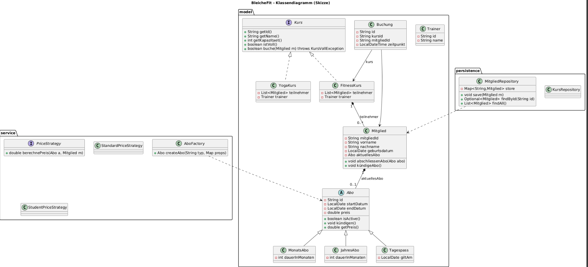
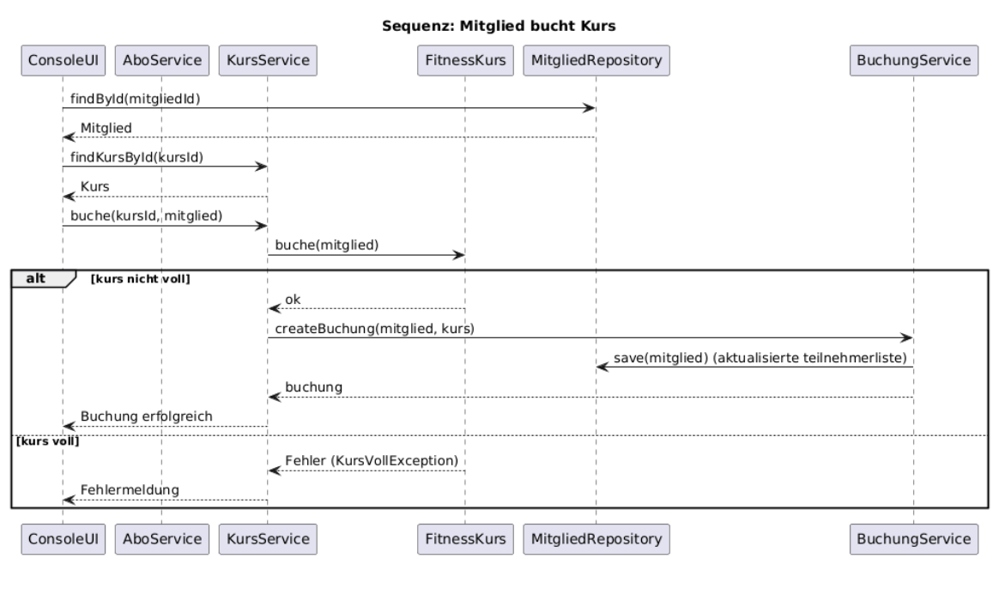

# BleicheFit Gym Manager (Konsolen-JavaApp)

## 1. Kurzbeschreibung der Applikation

**Name:**  
BleicheFit Gym Manager

**Ziel / Zweck:**  
Verwaltung von Mitgliedern, Abonnements (Abos), Kursen und Buchungen eines Fitnessstudios.  
Die Anwendung dient als Demonstration zentraler objektorientierter Konzepte und Design Patterns.

**Hauptfunktionen:**
- Mitgliederverwaltung
- Abonnement-Management
- Kursverwaltung und Buchungen
- Persistente Datenspeicherung
- Anwendung von OOP-Prinzipien und Design Patterns

---

## 2. Muss-Kriterien (erfüllt)

- OO-Architektur mit **mind. 8 Klassen**
- Interface für `Kurs`
- Oberklasse `Abo` mit konkreten Subklassen:
    - `MonatsAbo`
    - `JahresAbo`
    - `Tagespass`
- Kurse implementieren `Kurs`-Interface:
    - `Fitnesskurs`
    - `YogaKurs`
- Implementierte Use Cases:
    - Mitglied anlegen
    - Abo abschließen
    - Kurs buchen
    - Mitglied kündigt Abo
    - Liste anzeigen
- Persistenz (dateibasiert mit JSON oder Serialisierung)
- Einfache Validierung & Exception Handling
- Mindestens **2 Design Patterns**:
    - Factory (z. B. `AboFactory`)
    - Strategy (z. B. Preisstrategien)
- Clean Code & sinnvolle Paketstruktur

---

## 3. Nice-to-have (optional)

- Rabatt-Strategien (z. B. `Student`, `Senior`) via **Strategy Pattern**
- Undo/Redo für Buchungen
- CSV-Export / -Import
- Mehrere Zahlungsarten (Simulation)

---

## 4. Use Cases

### Mitglied anlegen
- Benutzer gibt persönliche Daten ein
- Neues `Mitglied` wird erstellt und gespeichert

### Abo abschließen
- Mitglied wählt Abo-Typ
- `AboFactory` erzeugt entsprechendes Abo
- `Mitglied.aktuellesAbo` wird gesetzt
- Daten werden persistiert

### Kurs erstellen (Admin/Trainer)
- Kurs mit Kapazität und Trainer wird angelegt
- Kursobjekt wird gespeichert

### Kurs buchen
- Mitglied bucht Kurs
- Kapazität wird geprüft
- `Buchung` wird erstellt
- Teilnehmerliste aktualisiert

### Abo kündigen
- Mitglied kündigt Abo
- Abo wird deaktiviert / Kündigungsdatum gesetzt

### Mitgliederliste anzeigen
- Alle Mitglieder + aktuelles Abo anzeigen

### Kurse anzeigen / Teilnehmerliste
- Alle Kurse + belegte Plätze anzeigen

### Persistenz
- Daten werden beim Start geladen
- Beim Beenden gespeichert